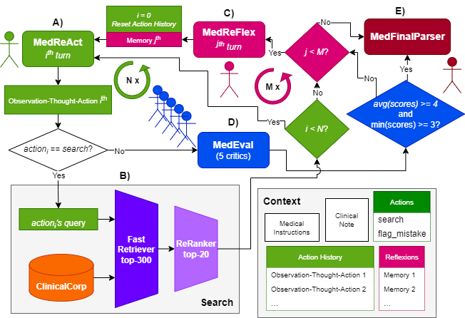

# IryoNLP @ MEDIQA-CORR Challenge

</img>

**Figure 1.** Schema of MedReAct'N'MedReFlex (i.e. associated with script `reflexion.py`) along the context of the clinical error correction task accessible to all medical agents (MedReAct, MedReFlex, MedEval and MedFinalParser). A) The MedReAct agent is first providing an observation, a thought and an action. B) In the case of a search action, it triggers a  semantic search over ClinicalCorp using MedReAct's query. C) After $N$ unsuccessful searches from MedReAct, the MedReFlex agent reflects about the current situation and suggest a solution. Then, MedReAct might start again. D) Once MedReAc selects the final_mistake action, the five MedEval agents review the answer and give a score between 1 and 5. E) If the average is above or equal to 4 and the minimum above or equal 3, the MedFinalParser agent formats the final answer into a JSON object. If the answer is not satisfactory, ReFlex is instead triggered. If ReFlex reaches unsuccessfully the Mth turns, MedFinalParser concludes that there is no error.

## Environment

To setup environment:

    pip install -r requirements.txt

Provide a `.env` file for semantic-kernel with azure openai environment variables using authentification with the azure token provider:

    AZURE_DEPLOYMENT_NAME=[DEPLOYMENT NAME]
    AZURE_ENDPOINT=[ENDPOINT]
    AZURE_OPENAI_API_VERSION=[VERSION]

## Create ChromaDB Vector Database

*ChromaDB installation can raise issues depending on the environment. We highly recommand to use a chromadb docker container instance as back-end.*

Check doc here [https://docs.trychroma.com/getting-started](url). `sqlite3` can be problematic to install, but the hack is provided in `fill_db.py` to swap `pysqlite3` as `sqlite3` for the required latest version of `sqlite3`.

Check bash script for general idea about how to use CLI `fill_db.py`. Available here:

    ./fill_database.sh

It invokes python like this:

    python -m fill_db -p $CHROMA_PATH -fs $FEW_SHOTS -mw $SOURCE_DIR -em $EMBEDER

- `$EMBEDER` is the path to the embedding model from HuggingFace.
- One of the two following sources:
    - `$FEW_SHOTS` is the path to the train set loaded into pandas in memory to dump in chromadb. This is used for the baseline with `./run.sh`.
    - `$SOURCE_DIR` this is to point to a local HuggingFace dataset to load into the vector database for semantic search for both `react.sh` and `reflexion.sh`.
- `$CHROMA_PATH` is the path to create the db's directory. This is only required for a persistent client with local database. Make it empty if you are using the docker container alternative.

Once created, it can be used in the previous section for dynamic KNN vector search.

## ClinicalCorp

The ClinicalCorp is a corpus built from the `guidelines`, `MedCorp` and `MedWiki` datasets. Some preprocessing code to prepare the data for `fill_database.sh` is available in `clinical_corp`, but most datasets rely on the original methods to gather the data first. The easiest datasets to get are: `Guidelines` (open-source), `Textbook` from MedCorp and `MedWiki`.

### Guidelines

This corpus has an open-source and close-source parts.

#### Open-source

You can download the 8 open-source datasets (i.e. excluding ICRC which is not relevant for the task) from `guidelines` here: https://huggingface.co/datasets/epfl-llm/guidelines . We chunked the documents using LangChain's recurrent character text splitter and we provided this version here: https://huggingface.co/datasets/jpcorb20/rag_epfl_guidelines .

#### Close-source

This part of the corpus require scrapping locally with the github repository from `Meditron` inside `gap-replay/guidelines` directory: https://github.com/epfLLM/meditron/tree/main/gap-replay . This part is tricky, and requires custom installations and debugging most likely. We specifically used in ClinicalCorp: Drugs.com, GuidelineCentral, AAFP, IDSA, and CPS. After that, the parsing needs to be done with `RecursiveCharacterTextSplitter` from LangChain (`chunk_size=1000` and `chunk_overlap=200`).

### MedCorp

#### Textbooks
The `Textbooks` dataset is available here: https://huggingface.co/datasets/MedRAG/textbooks .

#### StatPearl
The `StatPearl` dataset can be scrapped following these:
- General Info: https://huggingface.co/datasets/MedRAG/statpearls
- Scrapping and chunking code: https://github.com/Teddy-XiongGZ/MedRAG/blob/main/src/data/statpearls.py

### MedWiki

The MedWiki dataset is available on the HF Hub here: [jpcorb20/medical_wikipedia](https://huggingface.co/datasets/jpcorb20/medical_wikipedia).

## Baseline Few-Shot on Parametric Memory only
### Run baseline few-shot

Check bash script for general idea about how to use CLI `main.py`. Available here:

    ./run.sh

It invokes python like this:

    python -m main -f $FILE -fs $FEW_SHOTS -n 3 -o "output"

`$FILE` is CSV file provided by MEDIQA-Corr (usually, validation set) loaded with pandas `DataFrame`. There are sampling parameters for dev purposes (sampling of validation set with `-s 50` and skip first rows with `-sr 16`).
`$FEW_SHOTS` is the train set CSV file from which to sample `n` examples randomly each inference. These variables can also work for dynamic KNN vector search from chromadb vector database, `$FEW_SHOTS` needs to point to chromadb directory.

### Reasoning for CoT

To leverage the CoT prompting, we need reasoning for each element in the train set. Thus, we wrote a python CLI script `reasoning.py` to do so:

    ./reason.sh

## MedReAct

After preparation of the `ClinicalCorp`, the `MedReact` agent only method can be used with:

    python -m react -f $FILE -o $OUTPUT -db $CHROMA_PATH  -em $EMB_MODEL

## MedReflex

After preparation of the `ClinicalCorp`, the proposed MedReAct'N'MedReFkex method inspired by the Reflexion approach can be used with:

    python -m reflexion -f $FILE -o $OUTPUT -db $CHROMA_PATH -em $EMB_MODEL

## Evaluation

The original code available here [https://github.com/abachaa/MEDIQA-CORR-2024](url), which was refactored to use more easily as a CLI.

    ./score.sh

Calling the python

    python -m evaluation.cli -f $SUBMISSION_FILE -c $REF_CSV  -m $MODEL_DIR -fr

`$SUBMISSION_FILE` is the output file from the `main.py`.
`$REF_CSV` is the reference valiation CSV.
`MODEL_DIR` is the directory containing the models used for BLEURT and BERTSCORE.
`-fr` (as in "filter reference") mode is used to filter only on identifiers present in the submission file to compute realistic metrics on subsets of the validation set. Missed identifiers will be displayed.

## Contributing

This project welcomes contributions and suggestions.  Most contributions require you to agree to a
Contributor License Agreement (CLA) declaring that you have the right to, and actually do, grant us
the rights to use your contribution. For details, visit https://cla.opensource.microsoft.com.

When you submit a pull request, a CLA bot will automatically determine whether you need to provide
a CLA and decorate the PR appropriately (e.g., status check, comment). Simply follow the instructions
provided by the bot. You will only need to do this once across all repos using our CLA.

This project has adopted the [Microsoft Open Source Code of Conduct](https://opensource.microsoft.com/codeofconduct/).
For more information see the [Code of Conduct FAQ](https://opensource.microsoft.com/codeofconduct/faq/) or
contact [opencode@microsoft.com](mailto:opencode@microsoft.com) with any additional questions or comments.

## Citation

\[TBD\]
